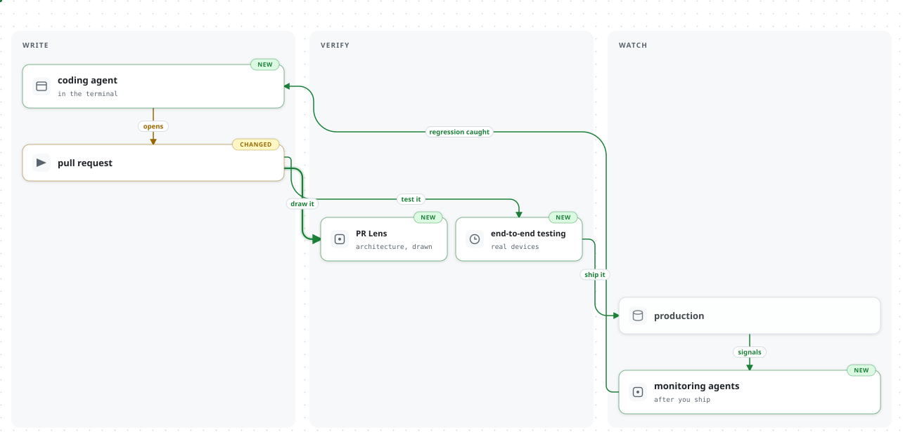

# Hi there

We're [Coldtea](https://www.coldtea.ai).

Agents made writing code fast. That's not news anymore. 

What's unsolved is the rest of it. Does the change work end-to-end?
  
Did it break something three services over? Is production still fine a week later, at 2 am, when no one's looking?

That's still yours to carry.

So we're building **one environment for the whole thing**. 

Write the code, regression test every PR on real devices, and leave monitoring agents watching production after you ship.

<picture>
  <source media="(prefers-color-scheme: dark)" srcset="lifecycle.dark.svg">
  
</picture>

Ship at agent speed. Break nothing.
